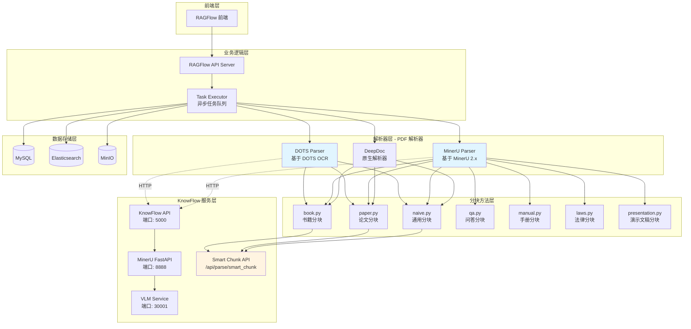
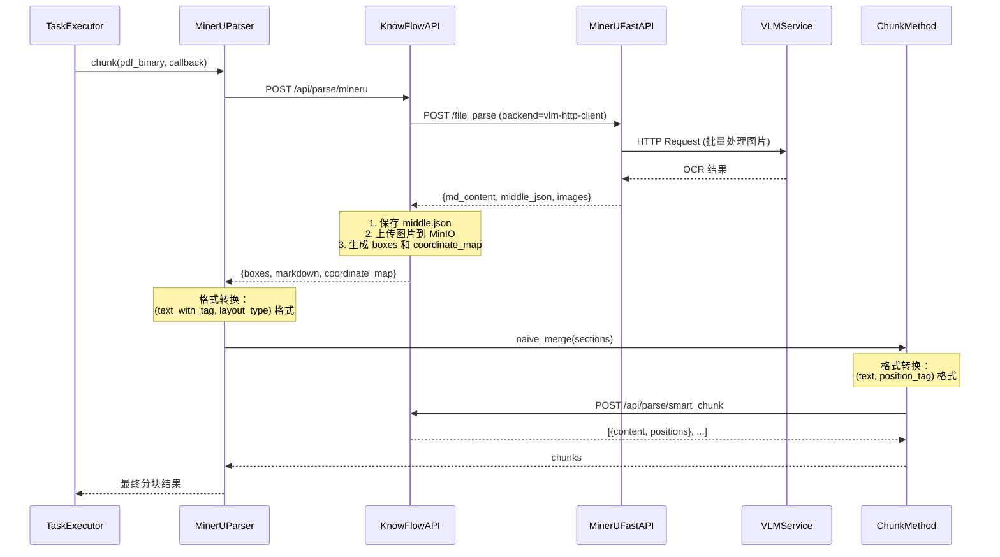
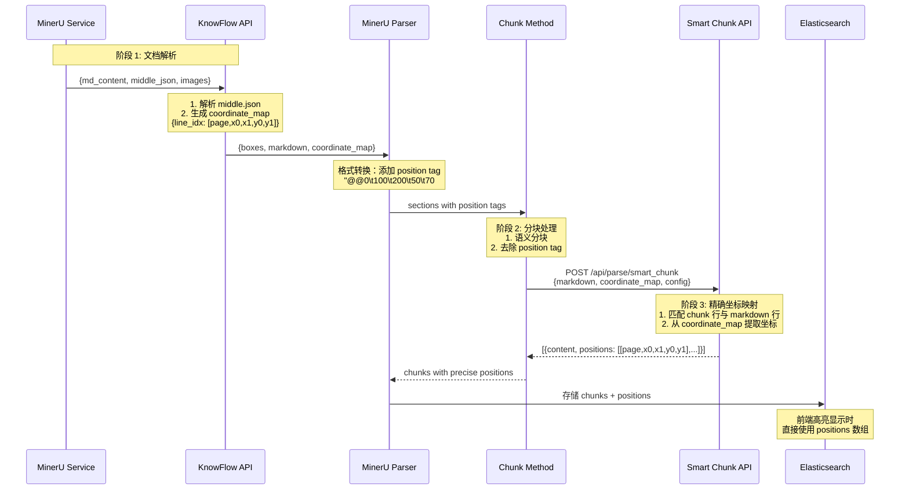
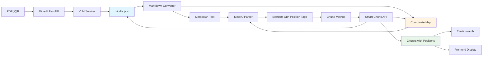

# MinerU/DOTS 文档解析技术架构方案

<div align="center">

**基于 MinerU 2.x 和 DOTS OCR 的高精度文档解析与分块系统**

版本：v2.0 | 更新时间：2025-01-06

</div>

---

## 📋 目录

1. [系统概述](#系统概述)
2. [整体架构](#整体架构)
3. [解析器设计](#解析器设计)
4. [坐标传递方案](#坐标传递方案)
5. [middle.json 与 Markdown 生成](#middlejson-与-markdown-生成)
6. [分块方法集成](#分块方法集成)
7. [API 接口设计](#api-接口设计)
8. [部署配置](#部署配置)
9. [性能优化](#性能优化)

---

## 系统概述

### 1.1 设计目标

KnowFlow 的 MinerU/DOTS 文档解析系统旨在解决以下核心问题：

- **精准坐标定位**：为每个文本块提供精确的 PDF 坐标，支持高亮显示
- **多模态内容**：同时处理文本、图片、表格、公式等多种内容类型
- **灵活分块策略**：支持与 RAGFlow 原生分块方法（naive、paper、book 等）无缝集成
- **高性能处理**：支持 GPU 加速的大规模文档批量处理
- **可扩展架构**：解析器与分块方法解耦，易于扩展新的解析引擎

### 1.2 核心优势

| 特性 | 传统方案 | MinerU/DOTS 方案 |
|------|---------|-----------------|
| **坐标精度** | 基于 OCR 相似度匹配 (~97%) | 基于 middle.json 直接映射 (100%) |
| **跨页合并** | 不支持 | 原生支持 cross_page 标记 |
| **多模态** | 文本为主 | 文本+图片+表格+公式 |
| **分块灵活性** | 固定分块策略 | 支持 naive/paper/book/qa 等多种策略 |
| **性能** | CPU 处理 | GPU 加速 + 批处理 |

---

## 整体架构

### 2.1 系统分层架构



### 2.2 架构设计原则

**核心设计理念：解析器与分块方法分离**

1. **解析器职责**（MinerU/DOTS/DeepDoc）
   - 将 PDF 转换为结构化的 markdown + 坐标信息
   - 返回格式：`[(text_with_position_tag, layout_type), ...]`
   - 示例：`("@@0\t100\t200\t50\t70##这是一段文本", "text")`

2. **分块方法职责**（naive/paper/book 等）
   - 接收解析器输出，按照语义规则进行分块
   - 处理格式：`[(text, position_tag), ...]`
   - 支持调用 Smart Chunk API 进行智能分块

3. **Smart Chunk API 职责**
   - 基于 middle.json 的精确坐标映射
   - 提供多种分块策略（smart、parent_child、regex 等）
   - 为每个 chunk 返回精确的坐标数组

---

## 解析器设计

### 3.1 MinerU Parser 实现

#### 核心流程



#### 关键代码实现

**文件位置：** `deepdoc/parser/mineru_parser.py`

```python
class MinerUParser(object):
    def __init__(self):
        # 从环境变量读取 KnowFlow Server URL
        self.knowflow_server_url = os.getenv(
            'KNOWFLOW_API_URL',
            'http://localhost:5000'
        )
        self.timeout = int(os.getenv('MINERU_PARSE_TIMEOUT', '300'))

    def chunk(self, filename, binary=None, from_page=0, to_page=100000,
              lang="Chinese", callback=None, kb_id=None, **kwargs):
        """
        MinerU 文档解析入口

        Returns:
            List[dict]: [
                {
                    "content_with_weight": str,  # 文本内容
                    "positions": [[page, x0, x1, y0, y1], ...],  # 坐标数组
                    "layout_type": str,  # 布局类型
                    "image": PIL.Image (可选)  # 图片对象
                },
                ...
            ]
        """
        # 1. 调用 KnowFlow API 进行 MinerU 解析
        response = self._call_mineru_api(
            binary, from_page, to_page, kb_id, callback
        )

        # 2. 获取结果
        boxes = response['boxes']  # 语义块级别（用于 general 分块）
        markdown_text = response['markdown']  # 逐行级别（用于 smart 分块）
        coordinate_map = response['coordinate_map']  # 坐标映射

        # 3. 转换为标准格式：(text_with_tag, layout_type)
        sections = self._convert_to_sections(boxes)

        return sections
```

**格式转换示例：**

```python
# MinerU 输出格式（由 KnowFlow API 返回）
boxes = [
    {
        'text': '# 第一章 引言',
        'page_number': 0,
        'x0': 100, 'x1': 500, 'top': 50, 'bottom': 80,
        'layout_type': 'title'
    },
    {
        'text': '这是一段正文内容。',
        'page_number': 0,
        'x0': 100, 'x1': 500, 'top': 100, 'bottom': 120,
        'layout_type': 'text'
    }
]

# 转换为 sections 格式（传递给分块方法）
sections = [
    ("@@0\t100\t500\t50\t80##第一章 引言", "title"),
    ("@@0\t100\t500\t100\t120##这是一段正文内容。", "text")
]
```

### 3.2 DOTS Parser 实现

DOTS Parser 与 MinerU Parser 架构完全一致，唯一区别是调用不同的后端服务：

**文件位置：** `deepdoc/parser/dots_parser.py`

```python
class DOTSParser(object):
    def __init__(self):
        self.knowflow_server_url = os.getenv(
            'KNOWFLOW_API_URL',
            'http://localhost:5000'
        )

    def chunk(self, filename, binary=None, from_page=0, to_page=100000,
              lang="Chinese", callback=None, kb_id=None, **kwargs):
        # 调用 /api/parse/dots 接口
        response = self._call_dots_api(...)
        return self._convert_to_sections(response['boxes'])
```

### 3.3 与分块方法的集成

**文件位置：** `rag/app/naive.py`（其他分块方法如 paper.py、book.py 同理）

```python
def chunk(filename, binary=None, from_page=0, to_page=100000,
          lang="Chinese", callback=None, doc_id=None, kb_id=None,
          parser_config=None, tenant_id=None, **kwargs):
    """
    通用分块方法（支持 DeepDoc/MinerU/DOTS 解析器）
    """
    # 1. 调用解析器（DeepDoc/MinerU/DOTS）
    parser = FACTORY[parser_id.lower()]
    sections = parser.chunk(
        filename, binary, from_page, to_page, lang, callback, kb_id, **kwargs
    )

    # 2. 格式转换（针对 MinerU/DOTS）
    if parser_id in ["mineru", "dots"]:
        converted_sections = []
        for text_with_tag, layout_type in sections:
            # 提取 position_tag: @@0\t100\t200\t50\t70##
            pattern = r'(@@\d+\t[\d.]+\t[\d.]+\t[\d.]+\t[\d.]+##)'
            match = re.match(pattern, text_with_tag)
            if match:
                position_tag = match.group(1)
                text = text_with_tag[len(position_tag):]
                converted_sections.append((text, position_tag))
            else:
                converted_sections.append((text_with_tag, ''))
        sections = converted_sections

    # 3. 执行通用分块逻辑
    chunks = naive_merge(
        sections,
        is_english(filename),
        parser_config.get("chunk_token_num", 128),
        parser_config.get("delimiter", "\n!?;。；！？")
    )

    # 4. 调用 Smart Chunk API 获取精确坐标
    if parser_id in ["mineru", "dots"] and kb_id:
        chunks = call_smart_chunk_api(chunks, doc_id, kb_id, parser_config)

    return chunks
```

---

## 坐标传递方案

### 4.1 坐标系统设计

#### 坐标格式定义

KnowFlow 支持两种坐标系统：

**1. MinerU 格式（72 DPI PDF 坐标）**

```python
# Position Tag 格式
"@@{page}\t{x0}\t{x1}\t{y0}\t{y1}##"

# 示例
"@@0\t100.5\t450.2\t50.0\t70.5##这是一段文本"

# 坐标含义
# page: 页码（从 0 开始）
# x0, x1: 水平方向左边界和右边界
# y0, y1: 垂直方向上边界和下边界
# 原点：PDF 左上角
```

**2. DOTS 格式（200 DPI 图像坐标）**

```python
# 坐标格式：[x0, y0, x1, y1]
[100, 50, 450, 70]

# 坐标含义
# x0, y0: 左上角坐标
# x1, y1: 右下角坐标
# 原点：图像左上角
# DPI: 200（需转换为 72 DPI）
```

#### 坐标转换算法

**文件位置：** `knowflow/server/services/knowledgebases/mineru_parse/coordinate_mappers.py`

```python
class CoordinateMapper:
    """坐标映射基类"""

    @abstractmethod
    def extract_positions_from_chunk(self, chunk_content: str) -> List[List]:
        """从 chunk 内容提取坐标"""
        pass

    @abstractmethod
    def build_chunk_positions(
        self,
        chunk_content: str,
        coordinate_map: Dict[int, List],
        markdown_lines: List[str]
    ) -> List[List]:
        """为 chunk 构建完整坐标数组"""
        pass

class MinerUCoordinateMapper(CoordinateMapper):
    """MinerU 坐标映射器（72 DPI PDF 坐标）"""

    def extract_positions_from_chunk(self, chunk_content: str) -> List[List]:
        """
        从带有 position tag 的文本中提取坐标

        Input: "@@0\t100\t200\t50\t70##文本内容"
        Output: [[0, 100, 200, 50, 70]]
        """
        positions = []
        pattern = r'@@(\d+)\t([\d.]+)\t([\d.]+)\t([\d.]+)\t([\d.]+)##'

        for match in re.finditer(pattern, chunk_content):
            page = int(match.group(1))
            x0 = float(match.group(2))
            x1 = float(match.group(3))
            y0 = float(match.group(4))
            y1 = float(match.group(5))
            positions.append([page, x0, x1, y0, y1])

        return positions

    def build_chunk_positions(
        self,
        chunk_content: str,
        coordinate_map: Dict[int, List],
        markdown_lines: List[str]
    ) -> List[List]:
        """
        基于 middle.json 的 coordinate_map 构建精确坐标

        Args:
            chunk_content: 分块文本（已去除 position tag）
            coordinate_map: {line_idx: [page, x0, x1, y0, y1], ...}
            markdown_lines: 完整 markdown 行列表

        Returns:
            [[page, x0, x1, y0, y1], ...]
        """
        positions = []
        chunk_lines = chunk_content.split('\n')

        # 在 markdown 中查找匹配的行
        for chunk_line in chunk_lines:
            chunk_line_clean = chunk_line.strip()
            if not chunk_line_clean:
                continue

            # 查找最佳匹配行
            for line_idx, md_line in enumerate(markdown_lines):
                if chunk_line_clean in md_line or md_line in chunk_line_clean:
                    if line_idx in coordinate_map:
                        coords = coordinate_map[line_idx]
                        positions.append(coords)
                        break

        return positions


class DOTSCoordinateMapper(CoordinateMapper):
    """DOTS 坐标映射器（200 DPI 图像坐标 -> 72 DPI PDF 坐标）"""

    DPI_SCALE = 72.0 / 200.0  # DOTS 使用 200 DPI，PDF 使用 72 DPI

    def extract_positions_from_chunk(self, chunk_content: str) -> List[List]:
        """
        DOTS 坐标格式：[page, [x0, y0, x1, y1]]
        需要转换为标准格式：[page, x0, x1, y0, y1]
        """
        positions = []
        # DOTS 坐标提取逻辑（根据实际格式调整）
        # ...
        return positions

    def build_chunk_positions(
        self,
        chunk_content: str,
        coordinate_map: Dict[int, List],
        markdown_lines: List[str]
    ) -> List[List]:
        """DOTS 坐标构建（含 DPI 转换）"""
        positions = []
        # ... 同 MinerU 逻辑

        # DPI 转换
        converted_positions = []
        for pos in positions:
            page, x0, y0, x1, y1 = pos
            converted_positions.append([
                page,
                x0 * self.DPI_SCALE,
                x1 * self.DPI_SCALE,
                y0 * self.DPI_SCALE,
                y1 * self.DPI_SCALE
            ])

        return converted_positions
```

### 4.2 坐标传递流程



### 4.3 坐标精度对比

| 方案 | 匹配方式 | 精度 | 性能 | 跨页支持 |
|------|---------|------|------|---------|
| **传统 OCR 匹配** | 文本相似度计算 | ~97% | 慢（需要全文匹配） | 否 |
| **middle.json 直接映射** | 行号索引 | 100% | 快（O(1) 查找） | 是 |

---

## middle.json 与 Markdown 生成

### 5.1 middle.json 数据结构

MinerU 2.x 生成的 `middle.json` 是整个坐标系统的核心数据源。

#### 完整数据结构

```json
{
  "_backend": "vlm-http-client",
  "_version_name": "2.1.0",
  "pdf_info": [
    {
      "page_idx": 0,
      "page_size": [595.32, 841.92],
      "layout_dets": [
        {
          "category_id": 0,
          "poly": [100.0, 50.0, 500.0, 50.0, 500.0, 80.0, 100.0, 80.0],
          "score": 0.98,
          "layout_label": "title"
        }
      ],
      "preproc_blocks": [
        {
          "type": "title",
          "bbox": [100.0, 50.0, 500.0, 80.0],
          "lines": [
            {
              "spans": [
                {
                  "type": "text",
                  "bbox": [100.0, 50.0, 300.0, 80.0],
                  "content": "第一章 引言",
                  "score": 0.99
                }
              ]
            }
          ]
        },
        {
          "type": "text",
          "bbox": [100.0, 100.0, 500.0, 200.0],
          "lines": [
            {
              "spans": [
                {
                  "type": "text",
                  "bbox": [100.0, 100.0, 500.0, 120.0],
                  "content": "这是第一段正文内容。",
                  "score": 0.98
                }
              ]
            },
            {
              "spans": [
                {
                  "type": "text",
                  "bbox": [100.0, 130.0, 500.0, 150.0],
                  "content": "这是第二段正文内容。",
                  "score": 0.97
                }
              ]
            }
          ],
          "_cross_page": true
        }
      ],
      "images": [
        {
          "bbox": [100.0, 250.0, 400.0, 450.0],
          "image_path": "images/page_0_img_0.png"
        }
      ]
    }
  ]
}
```

#### 关键字段说明

| 字段路径 | 类型 | 说明 |
|---------|------|------|
| `_backend` | string | 使用的后端类型（pipeline/vlm-http-client） |
| `pdf_info[].page_idx` | int | 页码（从 0 开始） |
| `pdf_info[].page_size` | [width, height] | 页面尺寸（72 DPI） |
| `pdf_info[].preproc_blocks[]` | array | 预处理后的内容块 |
| `preproc_blocks[].type` | string | 块类型（title/text/table/image/equation） |
| `preproc_blocks[].bbox` | [x0, y0, x1, y1] | 块的边界框坐标 |
| `preproc_blocks[].lines[]` | array | 文本行数组 |
| `preproc_blocks[]._cross_page` | bool | 是否跨页（重要！） |
| `lines[].spans[]` | array | 文本片段数组 |
| `spans[].content` | string | 实际文本内容 |
| `spans[].bbox` | [x0, y0, x1, y1] | 文本片段坐标 |

### 5.2 Markdown 生成策略

#### 两种生成模式

**文件位置：** `knowflow/server/services/knowledgebases/mineru_parse/middle_json_simple.py`

```python
class SimpleMiddleJsonConverter:
    """middle.json 转 markdown 转换器"""

    def __init__(self, kb_id='', merge_text_lines=False):
        """
        Args:
            kb_id: 知识库 ID（用于生成图片 URL）
            merge_text_lines:
                - True: 语义块级别（用于 general 分块）
                - False: 逐行级别（用于 smart 分块）
        """
        self.kb_id = kb_id
        self.merge_text_lines = merge_text_lines

    def convert(self, middle_json: dict) -> Tuple[str, Dict[int, List]]:
        """
        转换 middle.json 为 markdown + coordinate_map

        Returns:
            (markdown_text, coordinate_map)

            coordinate_map 格式：
            {
                0: [0, 100.0, 500.0, 50.0, 80.0],  # 第 0 行
                1: [0, 100.0, 500.0, 100.0, 120.0],  # 第 1 行
                ...
            }
        """
        pdf_info = middle_json.get('pdf_info', [])

        # 1. 提取所有页面的块
        block_pages = []
        for page_idx, page_data in enumerate(pdf_info):
            blocks = self._extract_blocks_from_page(page_data, page_idx)
            blocks.sort(key=lambda b: b['bbox'][1])  # 按 y0 坐标排序
            block_pages.append(blocks)

        # 2. 构建 markdown 和坐标映射
        markdown_lines, coordinate_map = self._build_markdown_from_block_pages(
            block_pages
        )

        markdown_text = '\n'.join(markdown_lines)
        return markdown_text, coordinate_map
```

#### 块提取逻辑

```python
def _extract_blocks_from_page(self, page_data: dict, page_idx: int) -> List[dict]:
    """从页面数据提取结构化块"""
    blocks = []
    preproc_blocks = page_data.get('preproc_blocks', [])

    for block in preproc_blocks:
        block_type = block.get('type', 'text')
        bbox = block.get('bbox', [0, 0, 0, 0])

        if block_type == 'title':
            # 标题块：添加 # 前缀
            level = self._infer_title_level(block)
            content = self._extract_text_from_block(block)
            blocks.append({
                'type': 'title',
                'level': level,
                'content': f"{'#' * level} {content}",
                'bbox': bbox,
                'page_idx': page_idx
            })

        elif block_type == 'text':
            # 文本块：根据 merge_text_lines 决定粒度
            if self.merge_text_lines:
                # 语义块级别：整个块作为一个单元
                content = self._extract_text_from_block(block)
                blocks.append({
                    'type': 'text',
                    'content': content,
                    'bbox': bbox,
                    'page_idx': page_idx,
                    'cross_page': block.get('_cross_page', False)
                })
            else:
                # 逐行级别：每行作为一个单元
                lines = block.get('lines', [])
                for line in lines:
                    line_content = self._extract_text_from_line(line)
                    line_bbox = self._calculate_line_bbox(line)
                    blocks.append({
                        'type': 'text',
                        'content': line_content,
                        'bbox': line_bbox,
                        'page_idx': page_idx
                    })

        elif block_type == 'table':
            # 表格块：转换为 HTML
            table_html = self._convert_table_to_html(block)
            blocks.append({
                'type': 'table',
                'content': table_html,
                'bbox': bbox,
                'page_idx': page_idx
            })

        elif block_type == 'image':
            # 图片块：生成 markdown 图片链接
            image_path = block.get('image_path', '')
            image_url = self._generate_image_url(image_path)
            blocks.append({
                'type': 'image',
                'content': f'',
                'bbox': bbox,
                'page_idx': page_idx
            })

    return blocks
```

#### Markdown 构建逻辑

```python
def _build_markdown_from_block_pages(
    self,
    block_pages: List[List[dict]]
) -> Tuple[List[str], Dict[int, List]]:
    """从块列表构建 markdown 行和坐标映射"""
    markdown_lines = []
    coordinate_map = {}
    line_idx = 0

    for page_blocks in block_pages:
        for block in page_blocks:
            content = block['content']
            bbox = block['bbox']
            page_idx = block['page_idx']

            # 多行内容分割
            content_lines = content.split('\n')
            for content_line in content_lines:
                if content_line.strip():
                    markdown_lines.append(content_line)

                    # 记录坐标映射
                    coordinate_map[line_idx] = [
                        page_idx,
                        bbox[0],  # x0
                        bbox[2],  # x1
                        bbox[1],  # y0
                        bbox[3]   # y1
                    ]

                    line_idx += 1

    return markdown_lines, coordinate_map
```

### 5.3 语义块 vs 逐行级别对比

| 模式 | 用途 | merge_text_lines | 生成结果 | 坐标粒度 |
|------|------|------------------|---------|---------|
| **语义块级别** | general 分块 | `True` | 每个 preproc_block 生成一行 | 块级坐标 |
| **逐行级别** | smart 分块 | `False` | 每个 line 生成一行 | 行级坐标 |

**示例对比：**

```python
# 输入：middle.json 中的一个文本块
block = {
    "type": "text",
    "bbox": [100, 100, 500, 200],
    "lines": [
        {"spans": [{"content": "第一行文本"}], "bbox": [100, 100, 500, 120]},
        {"spans": [{"content": "第二行文本"}], "bbox": [100, 130, 500, 150]},
        {"spans": [{"content": "第三行文本"}], "bbox": [100, 160, 500, 180]}
    ]
}

# 语义块级别输出（merge_text_lines=True）
markdown_lines = ["第一行文本第二行文本第三行文本"]
coordinate_map = {
    0: [0, 100, 500, 100, 200]  # 使用整个块的 bbox
}

# 逐行级别输出（merge_text_lines=False）
markdown_lines = ["第一行文本", "第二行文本", "第三行文本"]
coordinate_map = {
    0: [0, 100, 500, 100, 120],  # 第一行的 bbox
    1: [0, 100, 500, 130, 150],  # 第二行的 bbox
    2: [0, 100, 500, 160, 180]   # 第三行的 bbox
}
```

---

## 分块方法集成

### 6.1 支持的分块方法

KnowFlow 支持将 MinerU/DOTS 解析器与 RAGFlow 所有原生分块方法组合使用：

| 分块方法 | 文件路径 | 适用场景 | MinerU 支持 | DOTS 支持 |
|---------|---------|---------|------------|-----------|
| **naive** | `rag/app/naive.py` | 通用文档 | ✅ | ✅ |
| **paper** | `rag/app/paper.py` | 学术论文 | ✅ | ✅ |
| **book** | `rag/app/book.py` | 书籍 | ✅ | ✅ |
| **laws** | `rag/app/laws.py` | 法律文件 | ✅ | ✅ |
| **manual** | `rag/app/manual.py` | 技术手册 | ✅ | ✅ |
| **qa** | `rag/app/qa.py` | 问答对 | ✅ | ✅ |
| **table** | `rag/app/table.py` | 表格 | ✅ | ✅ |
| **resume** | `rag/app/resume.py` | 简历 | ✅ | ✅ |
| **picture** | `rag/app/picture.py` | 图片 | ✅ | ✅ |
| **presentation** | `rag/app/presentation.py` | 演示文稿 | ✅ | ✅ |
| **email** | `rag/app/email.py` | 电子邮件 | ✅ | ✅ |
| **knowledge_graph** | `rag/app/knowledge_graph.py` | 知识图谱 | ✅ | ✅ |
| **one** | `rag/app/one.py` | 单文档 | ✅ | ✅ |

### 6.2 集成模式

#### 模式 1：通用分块（naive）

**适用场景：** 所有文档类型的默认分块策略

**核心逻辑：**

```python
# rag/app/naive.py
def chunk(filename, binary=None, from_page=0, to_page=100000,
          lang="Chinese", callback=None, doc_id=None, kb_id=None,
          parser_config=None, tenant_id=None, **kwargs):
    """
    通用分块实现

    流程：
    1. 调用解析器（DeepDoc/MinerU/DOTS）
    2. 格式转换（针对 MinerU/DOTS）
    3. 执行 naive_merge 分块逻辑
    4. 调用 Smart Chunk API 获取精确坐标
    """
    parser_id = parser_config.get("parser_id", "deepdoc").lower()

    # 步骤 1: 调用解析器
    parser = FACTORY[parser_id]
    sections = parser.chunk(filename, binary, from_page, to_page, ...)

    # 步骤 2: 格式转换（MinerU/DOTS 专用）
    if parser_id in ["mineru", "dots"]:
        sections = convert_to_naive_format(sections)

    # 步骤 3: 通用分块逻辑
    chunks = naive_merge(
        sections,
        is_english=is_english(filename),
        chunk_token_num=parser_config.get("chunk_token_num", 128),
        delimiter=parser_config.get("delimiter", "\n!?;。；！？")
    )

    # 步骤 4: 获取精确坐标
    if parser_id in ["mineru", "dots"] and kb_id:
        chunks = enhance_chunks_with_smart_api(
            chunks, doc_id, kb_id, parser_config
        )

    return chunks


def naive_merge(sections, is_english, chunk_token_num, delimiter):
    """
    通用合并逻辑

    策略：
    - 按 token 数量限制合并
    - 遇到分隔符时可选择切分
    - 保留 position_tag
    """
    res = []
    current_chunk = {"content": "", "positions_tags": []}

    for text, pos_tag in sections:
        current_tokens = num_tokens_from_string(current_chunk["content"])
        new_tokens = num_tokens_from_string(text)

        if current_tokens + new_tokens > chunk_token_num:
            # 达到 token 上限，保存当前 chunk
            if current_chunk["content"]:
                res.append(current_chunk)
            current_chunk = {"content": text, "positions_tags": [pos_tag]}
        else:
            # 继续合并
            current_chunk["content"] += "\n" + text
            current_chunk["positions_tags"].append(pos_tag)

    # 保存最后一个 chunk
    if current_chunk["content"]:
        res.append(current_chunk)

    return res
```

#### 模式 2：论文分块（paper）

**适用场景：** 学术论文，识别标题层级和引用

**核心逻辑：**

```python
# rag/app/paper.py
def chunk(filename, binary=None, from_page=0, to_page=100000,
          lang="Chinese", callback=None, **kwargs):
    """
    论文分块实现

    特点：
    - 识别论文结构（Abstract、Introduction、Methods、Results 等）
    - 保留引用完整性
    - 按章节分块
    """
    parser_id = parser_config.get("parser_id", "deepdoc").lower()

    # 调用解析器
    sections = FACTORY[parser_id].chunk(...)

    # 格式转换（同 naive）
    if parser_id in ["mineru", "dots"]:
        sections = convert_to_naive_format(sections)

    # 论文特定逻辑
    chunks = []
    current_section = {"title": "", "content": "", "positions_tags": []}

    for text, pos_tag in sections:
        # 检测章节标题（# Abstract、## 1. Introduction 等）
        if is_section_title(text):
            if current_section["content"]:
                chunks.append(current_section)
            current_section = {
                "title": text,
                "content": "",
                "positions_tags": [pos_tag]
            }
        else:
            current_section["content"] += "\n" + text
            current_section["positions_tags"].append(pos_tag)

    # 保存最后一个章节
    if current_section["content"]:
        chunks.append(current_section)

    # 调用 Smart Chunk API
    if parser_id in ["mineru", "dots"]:
        chunks = enhance_chunks_with_smart_api(chunks, ...)

    return chunks
```

#### 模式 3：书籍分块（book）

**适用场景：** 书籍，按章节和标题层级分块

**核心逻辑：**

```python
# rag/app/book.py
def chunk(filename, binary=None, from_page=0, to_page=100000,
          lang="Chinese", callback=None, **kwargs):
    """
    书籍分块实现

    特点：
    - 识别多级标题（# 章、## 节、### 小节）
    - 按标题层级自动分块
    - 支持列表和引用块
    """
    parser_id = parser_config.get("parser_id", "deepdoc").lower()
    sections = FACTORY[parser_id].chunk(...)

    # 格式转换
    if parser_id in ["mineru", "dots"]:
        sections = convert_to_naive_format(sections)

    # 书籍分块逻辑
    chunks = []
    title_stack = []  # 标题层级栈
    current_chunk = {"content": "", "titles": [], "positions_tags": []}

    for text, pos_tag in sections:
        # 检测标题层级
        level = get_title_level(text)  # 返回 1-6（# 到 ######）

        if level > 0:
            # 遇到标题：保存当前 chunk
            if current_chunk["content"]:
                chunks.append(current_chunk)

            # 更新标题栈
            title_stack = title_stack[:level-1] + [text]

            current_chunk = {
                "content": "",
                "titles": title_stack.copy(),
                "positions_tags": [pos_tag]
            }
        else:
            # 普通文本：追加到当前 chunk
            current_chunk["content"] += "\n" + text
            current_chunk["positions_tags"].append(pos_tag)

    # 保存最后一个 chunk
    if current_chunk["content"]:
        chunks.append(current_chunk)

    # 调用 Smart Chunk API
    if parser_id in ["mineru", "dots"]:
        chunks = enhance_chunks_with_smart_api(chunks, ...)

    return chunks
```

### 6.3 Smart Chunk API 集成

**文件位置：** `rag/app/parser_utils.py`

```python
def enhance_chunks_with_smart_api(
    chunks: List[dict],
    doc_id: str,
    kb_id: str,
    parser_config: dict
) -> List[dict]:
    """
    调用 Smart Chunk API 为 chunks 补充精确坐标

    Args:
        chunks: [{"content": str, "positions_tags": [...]}, ...]
        doc_id: 文档 ID
        kb_id: 知识库 ID
        parser_config: 解析器配置

    Returns:
        [{"content": str, "positions": [[page,x0,x1,y0,y1], ...]}, ...]
    """
    knowflow_server_url = os.getenv('KNOWFLOW_API_URL', 'http://localhost:5000')
    api_url = f"{knowflow_server_url}/api/parse/smart_chunk"

    # 构建请求数据
    payload = {
        "doc_id": doc_id,
        "kb_id": kb_id,
        "chunks": chunks,  # 带有 positions_tags 的 chunks
        "chunking_config": {
            "strategy": parser_config.get("chunk_strategy", "smart"),
            "chunk_token_num": parser_config.get("chunk_token_num", 256)
        }
    }

    response = requests.post(api_url, json=payload, timeout=30)
    response.raise_for_status()

    result = response.json()
    enhanced_chunks = result['chunks']

    # 返回格式：
    # [
    #     {
    #         "content": "chunk 文本内容",
    #         "positions": [[0, 100, 500, 50, 80], [0, 100, 500, 100, 120], ...]
    #     },
    #     ...
    # ]

    return enhanced_chunks
```

---

## API 接口设计

### 7.1 MinerU 解析接口

**端点：** `POST /api/parse/mineru`

**请求格式：**

```http
POST /api/parse/mineru HTTP/1.1
Host: localhost:5000
Content-Type: multipart/form-data

file: <PDF 二进制文件>
from_page: 0
to_page: 100
kb_id: kb_12345
```

**响应格式：**

```json
{
  "success": true,
  "boxes": [
    {
      "text": "# 第一章 引言",
      "page_number": 0,
      "x0": 100.0,
      "x1": 500.0,
      "top": 50.0,
      "bottom": 80.0,
      "layout_type": "title"
    },
    {
      "text": "这是一段正文内容。",
      "page_number": 0,
      "x0": 100.0,
      "x1": 500.0,
      "top": 100.0,
      "bottom": 120.0,
      "layout_type": "text"
    }
  ],
  "markdown": "# 第一章 引言\n这是一段正文内容。\n...",
  "coordinate_map": {
    "0": [0, 100.0, 500.0, 50.0, 80.0],
    "1": [0, 100.0, 500.0, 100.0, 120.0]
  },
  "page_count": 10,
  "total_blocks": 150,
  "middle_json": { ... }  // 仅在 dev_mode 下返回
}
```

**实现代码：**

```python
# knowflow/server/routes/parse/mineru.py
@parse_bp.route('/api/parse/mineru', methods=['POST'])
def parse_with_mineru():
    """MinerU PDF 解析服务"""

    # 1. 接收文件
    file = request.files['file']
    from_page = int(request.form.get('from_page', 0))
    to_page = int(request.form.get('to_page', 100000))
    kb_id = request.form.get('kb_id', '')

    # 2. 调用 MinerU FastAPI 适配器
    adapter = get_global_adapter()
    result = adapter.process_file(
        file_path=temp_pdf_path,
        return_middle_json=True,
        return_images=True
    )

    # 3. 提取 middle_json
    result_doc_id = list(result['results'].keys())[0]
    doc_result = result['results'][result_doc_id]
    middle_json_data = doc_result.get('middle_json')

    # 4. 转换为 RAGFlow boxes 格式
    boxes, markdown_text, coordinate_map = _convert_to_ragflow_boxes(
        middle_json_data, from_page, to_page, kb_id
    )

    # 5. 上传图片到 MinIO
    if kb_id and 'images' in doc_result:
        images_dir = tempfile.mkdtemp(prefix='mineru_images_')
        _save_images_from_result(doc_result, images_dir)
        upload_directory_to_minio(kb_id, images_dir)

    # 6. 返回结果
    response = {
        'success': True,
        'boxes': boxes,
        'markdown': markdown_text,
        'coordinate_map': coordinate_map,
        'page_count': len(set(box['page_number'] for box in boxes)),
        'total_blocks': len(boxes)
    }

    # 开发模式：返回 middle_json
    if APP_CONFIG.dev_mode:
        response['middle_json'] = middle_json_data

    return jsonify(response), 200
```

### 7.2 Smart Chunk 接口

**端点：** `POST /api/parse/smart_chunk`

**请求格式：**

```json
{
  "doc_id": "doc_abc123",
  "kb_id": "kb_xyz789",
  "markdown_text": "# 第一章 引言\n这是一段文本...",
  "coordinate_map": {
    "0": [0, 100.0, 500.0, 50.0, 80.0],
    "1": [0, 100.0, 500.0, 100.0, 120.0]
  },
  "chunking_config": {
    "strategy": "smart",
    "chunk_token_num": 256,
    "min_chunk_tokens": 10
  }
}
```

**响应格式：**

```json
{
  "success": true,
  "chunks": [
    {
      "content": "# 第一章 引言\n这是一段文本内容。",
      "positions": [
        [0, 100.0, 500.0, 50.0, 80.0],
        [0, 100.0, 500.0, 100.0, 120.0]
      ],
      "token_count": 45,
      "chunk_id": "chunk_001"
    }
  ],
  "total_chunks": 25,
  "total_tokens": 5678
}
```

**实现代码：**

```python
# knowflow/server/routes/parse/chunk.py
@parse_bp.route('/api/parse/smart_chunk', methods=['POST'])
def smart_chunk():
    """智能分块服务（基于 middle.json 坐标映射）"""

    data = request.json
    doc_id = data['doc_id']
    kb_id = data['kb_id']
    markdown_text = data['markdown_text']
    coordinate_map = data['coordinate_map']
    chunking_config = data.get('chunking_config', {})

    # 读取 middle.json（从临时存储或缓存）
    middle_json_path = get_middle_json_path(doc_id)
    with open(middle_json_path, 'r') as f:
        middle_json = json.load(f)

    # 调用分块器
    chunker = get_chunker(chunking_config['strategy'])
    chunks = chunker.chunk(
        markdown_text=markdown_text,
        middle_json=middle_json,
        coordinate_map=coordinate_map,
        config=chunking_config
    )

    # 为每个 chunk 构建精确坐标
    enhanced_chunks = []
    for chunk in chunks:
        positions = build_chunk_positions(
            chunk['content'],
            coordinate_map,
            markdown_text.split('\n')
        )

        enhanced_chunks.append({
            'content': chunk['content'],
            'positions': positions,
            'token_count': chunk.get('token_count', 0),
            'chunk_id': chunk.get('id', '')
        })

    return jsonify({
        'success': True,
        'chunks': enhanced_chunks,
        'total_chunks': len(enhanced_chunks),
        'total_tokens': sum(c['token_count'] for c in enhanced_chunks)
    })
```

### 7.3 DOTS 解析接口

**端点：** `POST /api/parse/dots`

DOTS 接口与 MinerU 接口完全一致，只是调用不同的后端服务：

```python
@parse_bp.route('/api/parse/dots', methods=['POST'])
def parse_with_dots():
    """DOTS PDF 解析服务"""
    # 实现逻辑与 parse_with_mineru 相同
    # 唯一区别：调用 DOTS VLLM 服务而非 MinerU VLM
    ...
```

---

## 部署配置

### 8.1 环境变量配置

**文件位置：** `docker/.env`

```bash
# =======================================================
# KnowFlow Server URL (for RAGFlow to call KnowFlow)
# =======================================================
KNOWFLOW_API_URL=http://knowflow-backend:5000

# =======================================================
# MinerU Service Configuration
# =======================================================
# MinerU FastAPI 服务地址（容器间通信使用服务名）
MINERU_FASTAPI_URL=http://mineru-api:8888

# MinerU VLM HTTP 服务地址
MINERU_VLM_HTTP_SERVER_URL=http://mineru-vlm:30001

# MinerU 默认后端类型
MINERU_FASTAPI_BACKEND=vlm-http-client

# MinerU 超时时间（秒）
MINERU_FASTAPI_TIMEOUT=60000

# =======================================================
# DOTS Service Configuration
# =======================================================
# DOTS VLLM 服务地址
DOTS_VLLM_URL=http://dots-vllm:30001

# DOTS 超时时间（秒）
DOTS_TIMEOUT=300
```

### 8.2 settings.yaml 配置

**文件位置：** `knowflow/server/services/config/settings.yaml`

```yaml
# =======================================================
# MinerU 文档解析配置
# =======================================================
mineru:
  # FastAPI 客户端配置
  fastapi:
    # FastAPI 服务地址
    # Docker 部署：http://mineru-api:8888
    # 本地开发：http://localhost:8888
    url: "http://mineru-api:8888"

    # HTTP 请求超时时间（秒）
    timeout: 60000

  # 默认使用的后端类型
  # 选项: pipeline, vlm-http-client
  default_backend: "vlm-http-client"

  # Pipeline 后端请求参数
  pipeline:
    parse_method: "auto"
    lang: "ch"
    formula_enable: true
    table_enable: true

  # VLM 后端配置
  vlm:
    http_client:
      # VLM HTTP 服务器地址
      # Docker 部署：http://mineru-vlm:30001
      # 本地开发：http://localhost:30001
      server_url: "http://mineru-vlm:30001"

# =======================================================
# DOTS OCR 文档解析配置
# =======================================================
dots:
  vllm:
    # DOTS OCR 服务地址
    # Docker 部署：http://dots-vllm:30001
    # 本地开发：http://localhost:30001
    url: "http://dots-vllm:30001"

    model_name: "dotsocr-model"
    timeout: 300
    temperature: 0.1
    top_p: 1.0
    max_completion_tokens: 16384

  dev_mode: false
  cleanup_temp_files: true
```

### 8.3 Docker Compose 配置

**文件位置：** `docker/docker-compose.yml`

```yaml
services:
  ragflow-server:
    image: ${RAGFLOW_IMAGE}
    container_name: ragflow-server
    environment:
      # KnowFlow 集成配置
      - KNOWFLOW_API_URL=${KNOWFLOW_API_URL:-http://knowflow-backend:5000}

      # MinerU 配置
      - MINERU_FASTAPI_URL=${MINERU_FASTAPI_URL:-http://mineru-api:8888}
      - MINERU_VLM_HTTP_SERVER_URL=${MINERU_VLM_HTTP_SERVER_URL:-http://mineru-vlm:30001}
      - MINERU_FASTAPI_BACKEND=${MINERU_FASTAPI_BACKEND:-vlm-http-client}
      - MINERU_FASTAPI_TIMEOUT=${MINERU_FASTAPI_TIMEOUT:-60000}

      # DOTS 配置
      - DOTS_VLLM_URL=${DOTS_VLLM_URL:-http://dots-vllm:30001}
      - DOTS_TIMEOUT=${DOTS_TIMEOUT:-300}
    networks:
      - ragflow

  knowflow-backend:
    image: zxwei/knowflow-server:v2.1.3
    container_name: knowflow-backend
    ports:
      - "5000:5000"
    environment:
      # 同上，确保配置一致
      - MINERU_FASTAPI_URL=${MINERU_FASTAPI_URL:-http://mineru-api:8888}
      - MINERU_VLM_HTTP_SERVER_URL=${MINERU_VLM_HTTP_SERVER_URL:-http://mineru-vlm:30001}
      # ...
    volumes:
      - ../knowflow/server/services/config:/app/services/config:ro
    networks:
      - ragflow

  mineru-api:
    image: zxwei/mineru-api-full:2.1.0
    container_name: mineru-api
    ports:
      - "8888:8888"
      - "30001:30001"
    deploy:
      resources:
        reservations:
          devices:
            - driver: nvidia
              count: all
              capabilities: [gpu]
    shm_size: 32g
    networks:
      - ragflow
```

---

## 性能优化

### 9.1 批处理优化

**问题：** 大文档（50+ 页）处理时 VLM 服务容易超时或崩溃

**解决方案：** 分批处理（已废弃 - 会破坏跨页合并）

```python
# 不推荐：会破坏 cross_page 标记
# 推荐：增加服务器超时时间和显存配置
```

**正确做法：**

```bash
# 增加 vLLM 超时时间
export VLLM_ENGINE_ITERATION_TIMEOUT_S=600
export VLLM_RPC_TIMEOUT=300000
export VLLM_IMAGE_FETCH_TIMEOUT=60

# 调整 max-num-seqs（根据显存大小）
# 48GB GPU: max-num-seqs=512
# 24GB GPU: max-num-seqs=256
```

### 9.2 坐标映射优化

**问题：** 大文档的坐标映射效率低

**优化策略：**

```python
class CoordinateMapper:
    def __init__(self):
        self._cache = {}  # 缓存已匹配的行

    def build_chunk_positions(self, chunk_content, coordinate_map, markdown_lines):
        # 使用缓存避免重复匹配
        cache_key = hash(chunk_content)
        if cache_key in self._cache:
            return self._cache[cache_key]

        # 使用二分查找加速行匹配
        positions = self._fast_match_lines(chunk_content, markdown_lines, coordinate_map)

        self._cache[cache_key] = positions
        return positions
```

### 9.3 图片处理优化

**问题：** 图片上传到 MinIO 耗时

**优化策略：**

```python
# 异步批量上传图片
async def upload_images_async(images_dict, kb_id):
    async with aiohttp.ClientSession() as session:
        tasks = []
        for image_name, image_data in images_dict.items():
            task = upload_single_image(session, image_name, image_data, kb_id)
            tasks.append(task)

        results = await asyncio.gather(*tasks)

    return results
```

### 9.4 middle.json 缓存

**问题：** Smart Chunk API 多次读取 middle.json

**优化策略：**

```python
# 使用 Redis 缓存 middle.json
import redis

redis_client = redis.Redis(host='redis', port=6379, db=0)

def get_middle_json_cached(doc_id):
    # 尝试从 Redis 获取
    cache_key = f"middle_json:{doc_id}"
    cached_data = redis_client.get(cache_key)

    if cached_data:
        return json.loads(cached_data)

    # 缓存未命中，读取文件
    middle_json_path = get_middle_json_path(doc_id)
    with open(middle_json_path, 'r') as f:
        middle_json = json.load(f)

    # 缓存 1 小时
    redis_client.setex(cache_key, 3600, json.dumps(middle_json))

    return middle_json
```

---

## 附录

### A. 数据流图



### B. 关键文件索引

| 功能模块 | 文件路径 | 说明 |
|---------|---------|------|
| **解析器** | | |
| MinerU Parser | `deepdoc/parser/mineru_parser.py` | MinerU 解析器实现 |
| DOTS Parser | `deepdoc/parser/dots_parser.py` | DOTS 解析器实现 |
| **分块方法** | | |
| Naive | `rag/app/naive.py` | 通用分块 |
| Paper | `rag/app/paper.py` | 论文分块 |
| Book | `rag/app/book.py` | 书籍分块 |
| **KnowFlow 服务** | | |
| MinerU API | `knowflow/server/routes/parse/mineru.py` | MinerU 解析接口 |
| Smart Chunk API | `knowflow/server/routes/parse/chunk.py` | 智能分块接口 |
| **坐标处理** | | |
| Coordinate Mapper | `knowflow/server/services/knowledgebases/mineru_parse/coordinate_mappers.py` | 坐标映射器 |
| **middle.json 处理** | | |
| Markdown Converter | `knowflow/server/services/knowledgebases/mineru_parse/middle_json_simple.py` | middle.json 转 markdown |
| **适配器** | | |
| FastAPI Adapter | `knowflow/server/services/knowledgebases/mineru_parse/fastapi_adapter.py` | MinerU FastAPI 客户端 |
| **配置** | | |
| Settings | `knowflow/server/services/config/settings.yaml` | 业务配置 |
| Config Loader | `knowflow/server/services/config/config_loader.py` | 配置加载器 |

### C. 常见问题

**Q1: 为什么不直接在解析器返回坐标数组？**

A: 因为分块方法需要先进行语义合并，合并后的 chunk 需要重新计算坐标。如果解析器直接返回坐标，分块后需要重新匹配，反而增加复杂度。

**Q2: position_tag 和 coordinate_map 有什么区别？**

A:
- `position_tag`: 嵌入在文本中的坐标标记（如 `@@0\t100\t200##`），用于在分块过程中传递坐标信息
- `coordinate_map`: middle.json 生成的精确坐标映射表（`{line_idx: [page,x0,x1,y0,y1]}`），用于最终的精确坐标查找

**Q3: 为什么需要两种 markdown 生成模式？**

A:
- 语义块级别（`merge_text_lines=True`）：用于 general 分块，保留文档的语义结构
- 逐行级别（`merge_text_lines=False`）：用于 smart 分块，提供更细粒度的坐标映射

**Q4: 跨页合并如何实现？**

A: MinerU 的 middle.json 中包含 `_cross_page` 标记，标识跨页的文本块。在生成 markdown 时会保留这些块的完整性，不会在页面边界处切分。

**Q5: 如何选择分块策略？**

A:
- **naive**: 通用文档，按 token 数量分块
- **paper**: 学术论文，按章节分块
- **book**: 书籍，按标题层级分块
- **qa**: 问答对，按问题-答案对分块
- **table**: 表格，按表格结构分块

---

## 版本历史

| 版本 | 日期 | 更新内容 |
|------|------|---------|
| v2.0 | 2025-01-06 | 完整技术架构文档，新增坐标传递方案、middle.json 详解、分块方法集成 |
| v1.5 | 2024-12-20 | 新增 Smart Chunk API，优化坐标映射精度 |
| v1.0 | 2024-12-01 | MinerU/DOTS 解析器初版，支持基础分块 |

---

<div align="center">

**文档维护：** KnowFlow 开发团队
**技术支持：** 微信 skycode007
**开源地址：** [https://github.com/weizxfree/KnowFlow](https://github.com/weizxfree/KnowFlow)

</div>
