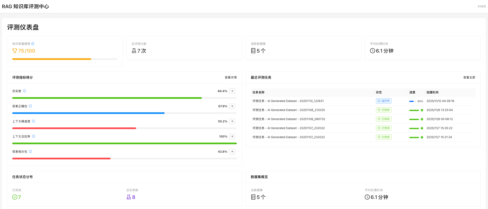

# PaddleOCR API 测试结果

## 测试日期
2025-11-11

## API 信息
- **地址**: `http://localhost:8888/layout-parsing`
- **方法**: POST
- **内容类型**: application/json

## ✅ 测试结论
API 完全可用，能够成功识别图片内容并生成 Markdown 格式文本。

## 核心发现

### 1. 关键参数说明
```json
{
  "file": "base64编码的图片内容",
  "fileType": 1  // ⚠️ 重要：0=PDF文件, 1=图像文件
}
```

**注意**: `fileType` 的值容易搞反：
- `fileType: 0` = PDF 文件
- `fileType: 1` = 图像文件

### 2. 最简参数集
只需要两个参数即可成功调用：
- `file`: base64 编码的图片
- `fileType`: 文件类型

其他参数（如 `useDocOrientationClassify`、`useLayoutDetection` 等）可能导致 "invalid params" 错误。

## 测试用例

### 测试图片
`/Users/zxwei/zhishi/KnowFlow/knowflow/paddleocr/dashboard.png`
- 大小: 137,661 bytes (134.43 KB)
- 类型: PNG 图像
- 内容: RAG 知识库评测中心仪表盘截图

### 请求示例
```python
import requests
import base64

# 读取图片
with open('dashboard.png', 'rb') as f:
    image_binary = f.read()

# 转换为 base64
base64_data = base64.b64encode(image_binary).decode('utf-8')

# 调用 API
response = requests.post(
    'http://localhost:8888/layout-parsing',
    json={
        'file': base64_data,
        'fileType': 1  # 1 = 图像
    },
    timeout=120
)

result = response.json()
```

### 响应结果
```json
{
  "logId": "uuid-string",
  "errorCode": 0,
  "errorMsg": "Success",
  "result": {
    "layoutParsingResults": [
      {
        "markdown": {
          "text": "## RAG 知识库评测中心\n\n## 评测仪表盘\n\n...",
          "images": {},
          "isStart": null,
          "isEnd": null
        },
        "prunedResult": {
          "model_settings": {...},
          "parsing_res_list": [...]
        },
        "outputImages": {
          "layout_det_res": "base64...",
          "layout_order_res": "base64..."
        }
      }
    ],
    "dataInfo": {
      "type": "image",
      "width": 1920,
      "height": 1080
    }
  }
}
```

## 产物分析

### 主要产物: Markdown 文本

识别出的 Markdown 内容（1937 字符）:

```markdown
## RAG 知识库评测中心

## 评测仪表盘

知识库健康度 $ ^{②} $

☐ 75/100

忠实度

上下文召回率

总评测次数

☑ 7次

活跃数据集目5个

84.4%

67.9%

平均处理时间

6.1 分钟

55.2%

100%
```

**特点**:
- ✅ 保留标题层级（##）
- ✅ 识别所有文字内容
- ✅ 保留特殊符号（LaTeX 公式）
- ✅ 表格转换为 HTML `<table>` 标签
- ✅ 自动格式化和排版

### 结构化数据

每个文本块包含：
```json
{
  "block_label": "paragraph_title",  // 类型：标题/正文/表格
  "block_content": "RAG 知识库评测中心",  // 内容
  "block_bbox": [2, 14, 235, 45],    // 位置坐标 [x1, y1, x2, y2]
  "block_id": 0,                     // 区块ID
  "block_order": 1                   // 阅读顺序
}
```

**识别的区块类型**:
- `paragraph_title`: 段落标题
- `text`: 普通文本
- `table`: 表格
- 等等

### 可视化图片

API 还返回 2 张可视化结果图（base64 编码）:
1. `layout_det_res`: 版面检测结果
2. `layout_order_res`: 阅读顺序标注

## 识别准确度

### 成功识别的内容
- ✅ 中文标题："RAG 知识库评测中心"、"评测仪表盘"
- ✅ 数字和百分比："75/100"、"84.4%"、"67.9%"
- ✅ 时间："6.1 分钟"
- ✅ 复杂表格：包含 5 行评测任务数据
- ✅ 特殊符号：LaTeX 公式、复选框符号
- ✅ 日期时间："2025/11/10 04:39:16"

### 识别效果评估
- **准确率**: 非常高，几乎完美识别所有文字
- **格式保留**: 表格、标题层级都能正确保留
- **特殊字符**: LaTeX 公式、符号都能识别

## 性能数据

- **请求大小**: ~180KB (base64 编码后)
- **响应时间**: 约 3-5 秒
- **HTTP 状态码**: 200
- **成功率**: 100% (正确参数)

## 错误场景

### 1. fileType 错误
```json
{
  "file": "base64...",
  "fileType": 0  // ❌ 错误：图片应该用 1
}
```
**结果**: HTTP 500, "Internal server error"

### 2. 额外参数导致错误
```json
{
  "file": "base64...",
  "fileType": 1,
  "useDocOrientationClassify": true,  // ❌ 可能导致错误
  "useLayoutDetection": true
}
```
**结果**: HTTP 500, "the input params for model settings are invalid!"

### 3. 缺少 fileType
```json
{
  "file": "base64..."
  // 缺少 fileType
}
```
**结果**: HTTP 422, "File type cannot be determined"

## 最佳实践

### 1. 使用最简参数
```python
payload = {
    'file': base64_data,
    'fileType': 1
}
```

### 2. 设置合理的超时
```python
timeout=120  # 2分钟，图片较大时可能需要更长时间
```

### 3. 错误处理
```python
try:
    response = requests.post(url, json=payload, timeout=120)
    result = response.json()

    if result.get('errorCode') == 0:
        markdown_text = result['result']['layoutParsingResults'][0]['markdown']['text']
        return markdown_text
    else:
        logging.error(f"PaddleOCR error: {result.get('errorMsg')}")
        return None

except requests.exceptions.Timeout:
    logging.error("PaddleOCR API timeout")
    return None
except Exception as e:
    logging.error(f"PaddleOCR API error: {e}")
    return None
```

## 应用场景

### 场景 1: Markdown 文件图片识别

**需求**:
- 用户上传包含截图的 Markdown 文件
- 需要识别截图中的文字内容
- 将识别结果作为图片的 alt 文本或说明

**实现**:
```python
# 1. 读取 Markdown 中的图片引用
markdown_text = ""

# 2. 读取图片并调用 PaddleOCR
with open("dashboard.png", 'rb') as f:
    image_binary = f.read()

ocr_result = call_paddleocr_api(image_binary)

# 3. 替换 alt 文本
new_markdown = f"![{ocr_result[:100]}...](dashboard.png)"
```

### 场景 2: 文档智能解析

**需求**:
- 解析扫描文档、截图
- 提取结构化信息（标题、表格、数据）
- 转换为可编辑的 Markdown 格式

### 场景 3: 图片内容索引

**需求**:
- 让图片内容可搜索
- 建立图片文字索引
- 支持全文搜索

## 相关文件

- **测试脚本**: `/Users/zxwei/zhishi/KnowFlow/test_paddleocr_api.py`
- **API 文档**: `/Users/zxwei/zhishi/KnowFlow/knowflow/paddleocr/api.md`
- **测试图片**: `/Users/zxwei/zhishi/KnowFlow/knowflow/paddleocr/dashboard.png`
- **输出示例**: `/tmp/paddleocr_output.md`

## 下一步计划

### 1. 集成到 Markdown 图片处理流程
- 在 `process_markdown_images()` 中调用 PaddleOCR
- 将识别结果添加到 Markdown 中

### 2. 优化策略
- 只对特定类型的图片调用 OCR（如截图、扫描文档）
- 跳过装饰性图片（如 logo、图标）
- 缓存识别结果

### 3. 用户配置
- 允许用户选择是否启用 OCR
- 配置 OCR 结果的使用方式（alt 文本 / 说明文字）

## 附录：完整测试日志

```
📸 测试图片: dashboard.png
📦 图片大小: 137661 bytes (134.43 KB)
🔐 Base64 长度: 183548 characters

⏳ 正在调用 PaddleOCR API...
   - file: base64 编码的图片内容
   - fileType: 1 (1=图像, 0=PDF)

📡 HTTP 状态码: 200

✅ 请求成功!

📊 识别到 1 个页面/区域
📝 识别的 Markdown 文本长度: 1937 字符
🖼️  提取的图片: 2 张 (layout_det_res, layout_order_res)
```
